  

  &nbsp;&nbsp;&nbsp;
  &nbsp;&nbsp;&nbsp;
  &nbsp;&nbsp;&nbsp;
  

  
  &nbsp;
  

 

## <samp>~/about</samp>

<samp>I build software where <strong>product engineering</strong>, <strong>infrastructure</strong> and <strong>AI</strong> meet — payment platforms, cloud-native systems, multi-tenant SaaS and AI-enabled products. Clear architecture, operational reliability, real problems.</samp>

> <samp>Good code solves a real problem with elegance.</samp>

## <samp>~/now</samp>

<table>
  <tr>
    <td width="48" align="center"></td>
    <td width="46%"><samp><strong>Payment infrastructure</strong> onboarding · routing · 3DS · risk · tokenization</samp></td>
    <td width="48" align="center"></td>
    <td width="46%"><samp><strong>Platform engineering</strong> Kubernetes · deploy automation · observability</samp></td>
  </tr>
  <tr>
    <td width="48" align="center"></td>
    <td width="46%"><samp><strong>Intelligent systems</strong> agents · copilots · OCR pipelines · automation</samp></td>
    <td width="48" align="center"></td>
    <td width="46%"><samp><strong>Distributed applications</strong> high-performance APIs · real-time · event-driven</samp></td>
  </tr>
</table>

## <samp>~/work</samp>

<table>
  <tbody>
    <tr>
      <td><samp><strong>MyPilotIndex</strong></samp></td>
      <td><samp>Senior Software Engineer &amp; AI Architect</samp></td>
      <td><samp>AI architecture · product engineering · integrations</samp></td>
      <td align="right"><samp>now</samp></td>
    </tr>
    <tr>
      <td><samp><strong>SJPR Group</strong></samp></td>
      <td><samp>Senior Full-Stack Developer</samp></td>
      <td><samp>Python services · AI · automation · infra</samp></td>
      <td align="right"><samp>2026 —</samp></td>
    </tr>
    <tr>
      <td><samp><strong>LeeilON Tecnologia</strong></samp></td>
      <td><samp>Senior Full-Stack Developer</samp></td>
      <td><samp>Flask · PostgreSQL · Keycloak · Next.js · K8s</samp></td>
      <td align="right"><samp>2025 —</samp></td>
    </tr>
    <tr>
      <td><samp><strong>Arest</strong></samp></td>
      <td><samp>Software Engineer</samp></td>
      <td><samp>PayFac infra · Rust services · distributed systems</samp></td>
      <td align="right"><samp>2025 —</samp></td>
    </tr>
  </tbody>
</table>

## <samp>~/stack</samp>

<table align="center">
  <tr>
    <td align="center" width="80"> <samp>TypeScript</samp></td>
    <td align="center" width="80"> <samp>JavaScript</samp></td>
    <td align="center" width="80"> <samp>Python</samp></td>
    <td align="center" width="80"> <samp>Rust</samp></td>
    <td align="center" width="80"> <samp>PHP</samp></td>
    <td align="center" width="80"> <samp>React</samp></td>
    <td align="center" width="80"> <samp>Next.js</samp></td>
    <td align="center" width="80"> <samp>Node.js</samp></td>
    <td align="center" width="80"> <samp>Django</samp></td>
    <td align="center" width="80"> <samp>Express</samp></td>
  </tr>
  <tr>
    <td align="center" width="80"> <samp>Docker</samp></td>
    <td align="center" width="80"> <samp>K8s</samp></td>
    <td align="center" width="80"> <samp>AWS</samp></td>
    <td align="center" width="80"> <samp>Cloudflare</samp></td>
    <td align="center" width="80"> <samp>Nginx</samp></td>
    <td align="center" width="80"> <samp>Linux</samp></td>
    <td align="center" width="80"> <samp>Git</samp></td>
    <td align="center" width="80"> <samp>Vercel</samp></td>
    <td align="center" width="80"> <samp>Netlify</samp></td>
    <td align="center" width="80"> <samp>D.Ocean</samp></td>
  </tr>
  <tr>
    <td align="center" width="80"> <samp>Postgres</samp></td>
    <td align="center" width="80"> <samp>MySQL</samp></td>
    <td align="center" width="80"> <samp>MongoDB</samp></td>
    <td align="center" width="80"> <samp>GraphQL</samp></td>
    <td align="center" width="80"> <samp>Tailwind</samp></td>
    <td align="center" width="80"> <samp>OpenAI</samp></td>
    <td align="center" width="80"> <samp>TensorFlow</samp></td>
    <td align="center" width="80"> <samp>PyTorch</samp></td>
    <td align="center" width="80"> <samp>Jest</samp></td>
    <td align="center" width="80"> <samp>Figma</samp></td>
  </tr>
</table>

  <samp>+ FastAPI · Flask · Laravel · Terraform · Redis · Keycloak · SQLAlchemy · eBPF (exploring)</samp>

## <samp>~/stats</samp>

  <picture>
    <source media="(prefers-color-scheme: dark)" srcset="https://github-readme-stats.vercel.app/api?username=lucasniceas&show_icons=true&hide_border=true&bg_color=00000000&title_color=58a6ff&icon_color=39d353&text_color=c9d1d9&ring_color=58a6ff&rank_icon=github" />
    
  </picture>
  <picture>
    <source media="(prefers-color-scheme: dark)" srcset="https://github-readme-stats.vercel.app/api/top-langs/?username=lucasniceas&layout=compact&hide_border=true&bg_color=00000000&title_color=58a6ff&text_color=c9d1d9&langs_count=8" />
    
  </picture>

  <picture>
    <source media="(prefers-color-scheme: dark)" srcset="https://streak-stats.demolab.com?user=lucasniceas&hide_border=true&background=00000000&ring=58a6ff&fire=39d353&currStreakNum=c9d1d9&sideNums=c9d1d9&currStreakLabel=58a6ff&sideLabels=8b949e&dates=6e7681&stroke=30363d" />
    
  </picture>

<picture>
  <source media="(prefers-color-scheme: dark)" srcset="https://raw.githubusercontent.com/lucasniceas/lucasniceas/output/github-snake-dark.svg" />
  <source media="(prefers-color-scheme: light)" srcset="https://raw.githubusercontent.com/lucasniceas/lucasniceas/output/github-snake.svg" />
  
</picture>

## <samp>~/contact</samp>

<samp>Open to high-impact engineering work, architecture consulting and selected product collaborations.</samp>

  <samp>
    <a href="https://www.lucasniceas.site">portfolio</a>&nbsp;·&nbsp;
    <a href="https://www.linkedin.com/in/lucas-nic%C3%A9as/">linkedin</a>&nbsp;·&nbsp;
    <a href="mailto:lucassniceaspt@hotmail.com">email</a>&nbsp;·&nbsp;
    <a href="https://lucasniceas.github.io/lucasniceas/">interactive 3D</a>
  </samp>

