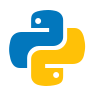
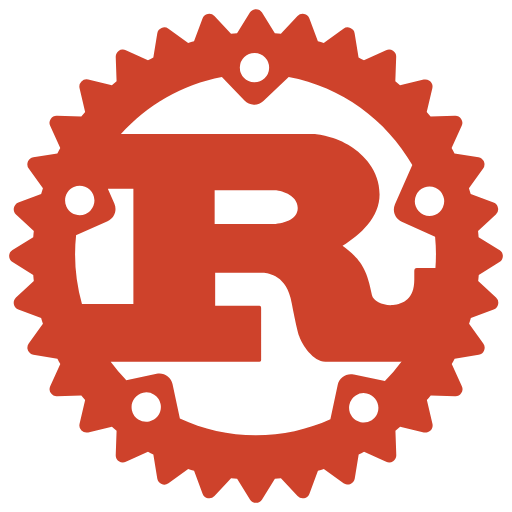
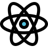
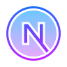
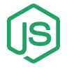
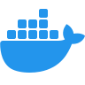
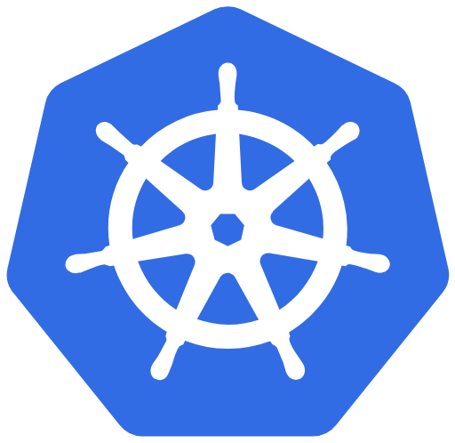
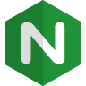
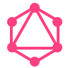
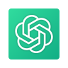

  

  &nbsp;&nbsp;
  &nbsp;&nbsp;
  &nbsp;&nbsp;
  

  Portugal · Remote collaboration · Software, infrastructure and AI

 

<h2>&nbsp; About</h2>

I design and build software where **product engineering**, **infrastructure** and **artificial intelligence** meet.

My work spans payment platforms, cloud-native systems, multi-tenant applications, internal developer tooling and AI-enabled products. I care about clear architecture, operational reliability and software that solves real problems under real constraints.

> Good code solves a real problem with elegance.

<h2>&nbsp; Current focus</h2>

<table>
  <tr>
    <td width="48" align="center"></td>
    <td width="46%"><strong>Payment infrastructure</strong> Merchant onboarding, payment routing, 3DS, risk, tokenization and financial operations.</td>
    <td width="48" align="center"></td>
    <td width="46%"><strong>Platform engineering</strong> Kubernetes platforms, deployment automation, observability and developer experience.</td>
  </tr>
  <tr>
    <td width="48" align="center"></td>
    <td width="46%"><strong>Intelligent systems</strong> AI agents, copilots, OCR pipelines, classification, integrations and workflow automation.</td>
    <td width="48" align="center"></td>
    <td width="46%"><strong>Distributed applications</strong> High-performance APIs, real-time data, event-driven services and resilient architectures.</td>
  </tr>
</table>

<h2>&nbsp; Selected work</h2>

<table>
  <thead>
    <tr>
      <th align="left">Organization</th>
      <th align="left">Role</th>
      <th align="left">Engineering scope</th>
      <th align="left">Period</th>
    </tr>
  </thead>
  <tbody>
    <tr>
      <td><strong>MyPilotIndex</strong></td>
      <td>Senior Software Engineer &amp; AI Architect</td>
      <td>AI architecture, product engineering and intelligent integrations</td>
      <td>Present</td>
    </tr>
    <tr>
      <td><strong>SJPR Group</strong></td>
      <td>Senior Full-Stack Developer</td>
      <td>Python services, AI, automation and infrastructure</td>
      <td>Jan 2026 — Present</td>
    </tr>
    <tr>
      <td><strong>LeeilON Tecnologia</strong></td>
      <td>Senior Full-Stack Developer</td>
      <td>Flask, SQLAlchemy, PostgreSQL, Keycloak, Next.js and Kubernetes</td>
      <td>Dec 2025 — Present</td>
    </tr>
    <tr>
      <td><strong>Arest</strong></td>
      <td>Software Engineer</td>
      <td>PayFac infrastructure, Rust services, payments and distributed systems</td>
      <td>Feb 2025 — Present</td>
    </tr>
  </tbody>
</table>

<h2>&nbsp; Tech stack</h2>

<table align="center">
  <tr>
    <td align="center" width="80"> TypeScript</td>
    <td align="center" width="80"> JavaScript</td>
    <td align="center" width="80"> Python</td>
    <td align="center" width="80"> Rust</td>
    <td align="center" width="80"> PHP</td>
    <td align="center" width="80"> React</td>
    <td align="center" width="80"> Next.js</td>
    <td align="center" width="80"> Node.js</td>
    <td align="center" width="80"> Django</td>
    <td align="center" width="80"> Express</td>
  </tr>
  <tr>
    <td align="center" width="80"> Docker</td>
    <td align="center" width="80"> Kubernetes</td>
    <td align="center" width="80"> AWS</td>
    <td align="center" width="80"> Cloudflare</td>
    <td align="center" width="80"> Nginx</td>
    <td align="center" width="80"> Linux</td>
    <td align="center" width="80"> Git</td>
    <td align="center" width="80"> Vercel</td>
    <td align="center" width="80"> Netlify</td>
    <td align="center" width="80"> DigitalOcean</td>
  </tr>
  <tr>
    <td align="center" width="80"> PostgreSQL</td>
    <td align="center" width="80"> MySQL</td>
    <td align="center" width="80"> MongoDB</td>
    <td align="center" width="80"> GraphQL</td>
    <td align="center" width="80"> Tailwind</td>
    <td align="center" width="80"> OpenAI</td>
    <td align="center" width="80"> TensorFlow</td>
    <td align="center" width="80"> PyTorch</td>
    <td align="center" width="80"> Jest</td>
    <td align="center" width="80"> Figma</td>
  </tr>
</table>

  Also working with: <code>FastAPI</code> · <code>Flask</code> · <code>Laravel</code> · <code>Terraform</code> · <code>Redis</code> · <code>Keycloak</code> · <code>SQLAlchemy</code>

<h2>&nbsp; Exploring</h2>

<code>eBPF</code> · <code>Low-level networking</code> · <code>Kubernetes operators</code> · <code>LLM infrastructure</code> · <code>Systems programming</code> · <code>Deep observability</code>

<h2>&nbsp; GitHub activity</h2>

  
  

  

<picture>
  <source media="(prefers-color-scheme: dark)" srcset="https://raw.githubusercontent.com/lucasniceas/lucasniceas/output/github-snake-dark.svg" />
  <source media="(prefers-color-scheme: light)" srcset="https://raw.githubusercontent.com/lucasniceas/lucasniceas/output/github-snake.svg" />
  
</picture>

<h2>&nbsp; Contact</h2>

I am open to high-impact engineering work, architecture consulting and selected product collaborations.

  <a href="https://www.lucasniceas.site">Portfolio</a>&nbsp;&nbsp;·&nbsp;&nbsp;
  <a href="https://www.linkedin.com/in/lucas-nic%C3%A9as/">LinkedIn</a>&nbsp;&nbsp;·&nbsp;&nbsp;
  <a href="mailto:lucassniceaspt@hotmail.com">Email</a>

